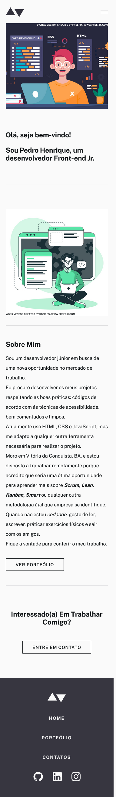

# Frontend Mentor - Minimalist Portfolio

This is a solution to the <a href="https://www.frontendmentor.io/challenges/minimalist-portfolio-website-LMy-ZRyiE">Minimalist Portfolio</a>  

*Frontend Mentor challenges help you improve your coding skills by building realistic projects.*

## Table of contents

- [Overview](#overview)
  - [The challenge](#the-challenge)
  - [Screenshots](#screenshots)
  - [Links](#links)
- [My process](#my-process)
  - [Built with](#built-with)
  - [What I learned](#what-i-learned)
  - [Continued development](#continued-development)
  - [Useful resources](#useful-resources)
- [Author](#author)

## Overview

### The challenge

Your users should be able to:

- (V) View the optimal layout for each page depending on their device's screen size
- (V) See hover states for all interactive elements throughout the site
- (V) Click the "About Me" call-to-action on the homepage and have the screen scroll down to the next section
- (V) Receive an error message when the contact form is submitted if:
- - (V) The Name, Email Address or Message fields are empty should show "This field is required" 
- - (V) The Email Address is not formatted correctly should show "Please use a valid email address"

### Screenshots

  *OBS: THE IMAGES MAY NOT BE IN THE SAME SCALE.*

# MY SOLUTION - Frontend Mentor -  Minimalist Portfolio solution

  

  

### Links

- Solution URL: [Add solution URL here](#)
- Live Site URL: [Add live site URL here](#)

## My process

### Built with

- Semantic HTML5 markup
- Flexbox
- CSS custom properties
- CSS Grid
- CSS Animations
- - CSS Transitions
- - CSS Transform
- - CSS Animate.css library 
- - CSS CSS-animated hamburgers library
- Sass
- - Sass Variables
- - Sass Mixins
- Vue.JS
- - VueX
- - Vue Router
- Mobile-first workflow

### What I learned

This project was a great opportunity to practice Vue-Router and some CSS animation libraries. The portfolio will also be useful to show my past and future projects.

### Continued development

To my next project I want to test my Vue.JS skills by using an API.

### Useful resources

- <a href="https://developer.mozilla.org/pt-BR/docs/Web/CSS/align-self" target="_blank" alt="">align-self - CSS </a>
- <a href="https://www.w3schools.com/css/css3_transitions.asp" target="_blank" alt="CSS Transitions">CSS Transitions</a>
- <a href="https://stackoverflow.com/questions/5915023/preventing-images-and-text-to-be-selected/5915056" target="_blank" alt="Preventing images and text to be selected">Preventing images and text to be selected</a>
- <a href="https://www.youtube.com/watch?v=vc9rgFHr098" target="_blank">HTML Form to Mail | Create Full Functional HTML Form Without Any Back-end</a>
- <a href="https://stackoverflow.com/questions/25450600/what-does-the-svg-xmlns-attribute-do" target="_blank" alt="">What does the SVG xmlns attribute do?</a>
- <a href="https://www.w3schools.com/graphics/svg_path.asp" target="_blank" alt="">The <path> element</a>
- <a href="https://iconmonstr.com" target="_blank" alt="">SVG <path> Icons</a>
- <a href="https://jonsuh.com/hamburgers/" target="_blank" alt="">Tasty CSS-animated hamburgers</a>
- <a href="https://animate.style" target="_blank" alt="">Animate.css</a>
  
## Author

- Frontend Mentor - [@Pedrohamoura-Git](https://www.frontendmentor.io/profile/Pedrohamoura-Git)
- Instagram - [@ph_pedrohenrique21](https://www.instagram.com/ph_pedrohenrique21/)
